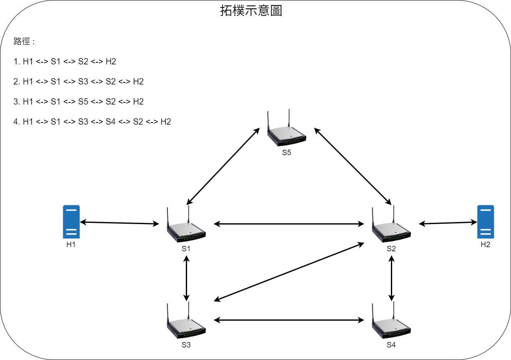

# **SDN_Select_Path**

### **製作者 : 王采風**

### **簡介**
本專案利用 **Ryu Controller** 搭配 **Mininet** 實作一個 **可自訂封包傳送路徑的 SDN 環境**。  
透過 REST API，使用者可以查詢拓樸、列出主機間的候選路徑，並動態安裝/刪除流表，達到 **封包路徑控制與切換** 的目的。


## **系統總覽（Architecture）**

```css
 Host h1                                  SDN Switches                                    Host h2
(Client)   <-- OpenFlow Rules -->   [ Path Selection Control ]   <-- OpenFlow Rules -->   (Server)
  發送封包          封包依規則轉送 (L2/L3)              接收封包
                    ^                                     |
                    |   REST API (Topology/Path Control)  |
                    +---------------- Ryu Controller -----+
                                    (path_selection.py)
```
<br>

## **自訂拓樸示意圖**

<br>

## **執行方式&功能**

### 1. 啟動Ryu
```bash
ryu-manager --observe-links --wsapi-port 8080 path_selection.py --ofp-tcp-listen-port 6633
```
<br>

### 2. 啟動Mininet
```bash
sudo mn --custom topo.py --topo user_mesh \
    --controller=remote,ip=127.0.0.1,port=6633 \
    --switch ovsk,protocols=OpenFlow13 --mac --link=tc
```
<br>

### 3. API 功能

**查詢拓樸**
方法(GET) : /topo
```bash
curl http://127.0.0.1:8080/topo | jq .
```
<br>

**查詢目前學到的主機位置**
方法(GET) : /hosts
```bash
curl http://127.0.0.1:8080/hosts | jq .
```
<br>

**查詢路徑**
方法(GET) : /paths?來源地&目的地
```bash
curl "http://127.0.0.1:8080/paths?src_mac=02:00:00:00:00:01&dst_mac=02:00:00:00:00:02" | jq .
```
<br>

**安裝指定路徑**
方法(POST) : /paths -H 'Content-Type: application/json' -d '{來源地,目的地,路徑id}'
(-H 'Content-Type: application/json'，我有指定用json所以必加。bidirectional會預設是true不用特別寫)
```bash
curl -X POST http://127.0.0.1:8080/path \
    -H 'Content-Type: application/json' \
    -d '{"src_mac":"02:00:00:00:00:01","dst_mac":"02:00:00:00:00:02","path_id":1,"bidirectional":true}'
```
<br>

**刪除指定路徑**
方法(DELETE) : /paths?來源地&目的地
```bash
curl -X DELETE "http://127.0.0.1:8080/paths?src_mac=02:00:00:00:00:01&dst_mac=02:00:00:00:00:02" | jq .
```


### **執行範例影片**
[C_Custom_Packet viedo](https://youtu.be/dJa6oouFyHk)
